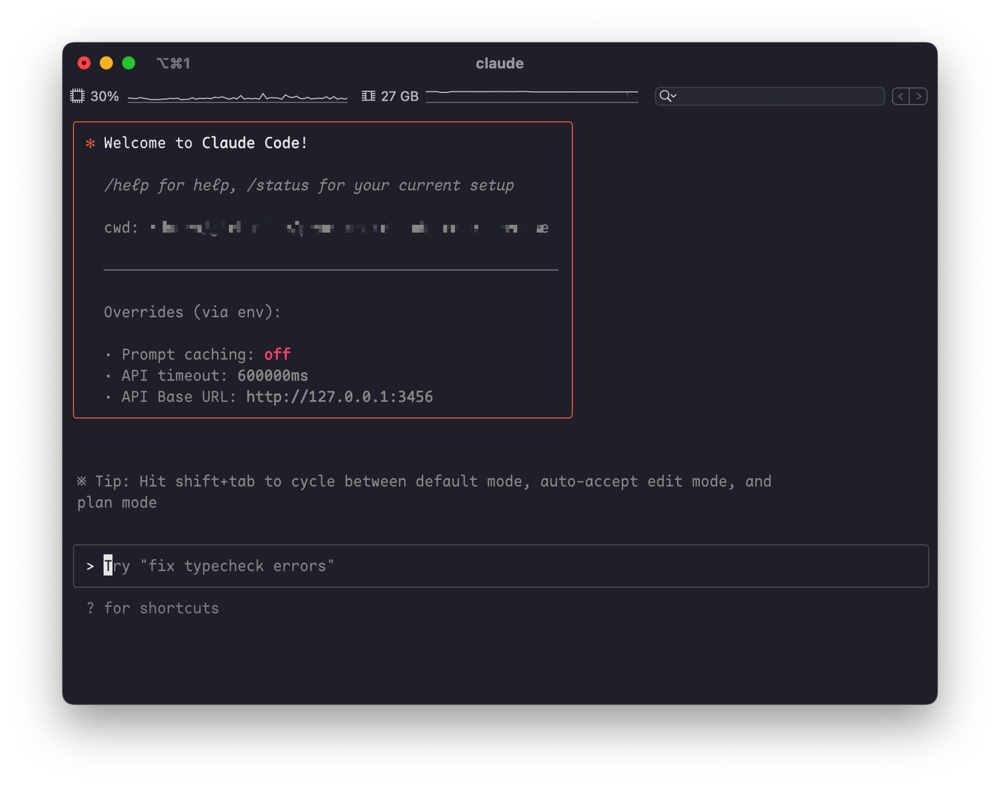
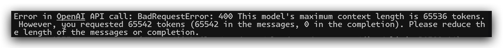

# Claude Code Router

> This is a tool for routing Claude Code requests to different models, and you can customize any request.




## Usage

1. Install Claude Code

```shell
npm install -g @anthropic-ai/claude-code
```

2. Install Claude Code Router

```shell
npm install -g @musistudio/claude-code-router
```

3. Start Claude Code by claude-code-router

```shell
ccr code
```

4. Configure routing[optional]    
Set up your `~/claude-code-router/config.json` file like this:
```json
{
  "OPENAI_API_KEY": "sk-xxx",
  "OPENAI_BASE_URL": "https://api.deepseek.com",
  "OPENAI_MODEL": "deepseek-chat",
  "Providers": [
    {
      "name": "openrouter",
      "api_base_url": "https://openrouter.ai/api/v1",
      "api_key": "sk-xxx",
      "models": [
        "google/gemini-2.5-pro-preview",
        "anthropic/claude-sonnet-4",
        "anthropic/claude-3.5-sonnet",
        "anthropic/claude-3.7-sonnet:thinking"
      ]
    },
    {
      "name": "deepseek",
      "api_base_url": "https://api.deepseek.com",
      "api_key": "sk-xxx",
      "models": ["deepseek-reasoner"]
    },
    {
      "name": "ollama",
      "api_base_url": "http://localhost:11434/v1",
      "api_key": "ollama",
      "models": ["qwen2.5-coder:latest"]
    }
  ],
  "Router": {
    "background": "ollama,qwen2.5-coder:latest",
    "think": "deepseek,deepseek-reasoner",
    "longContext": "openrouter,google/gemini-2.5-pro-preview"
  }
}
```
- `background`    
This model will be used to handle some background tasks([background-token-usage](https://docs.anthropic.com/en/docs/claude-code/costs#background-token-usage)). Based on my tests, it doesn’t require high intelligence. I’m using the qwen-coder-2.5:7b model running locally on my MacBook Pro M1 (32GB) via Ollama.
If your computer can’t run Ollama, you can also use some free models, such as qwen-coder-2.5:3b.


- `think`    
This model will be used when enabling Claude Code to perform reasoning. However, reasoning budget control has not yet been implemented (since the DeepSeek-R1 model does not support it), so there is currently no difference between using UltraThink and Think modes.
It is worth noting that Plan Mode also use this model to achieve better planning results.    
Note: The reasoning process via the official DeepSeek API may be very slow, so you may need to wait for an extended period of time.


- `longContext`   
This model will be used when the context length exceeds 32K (this value may be modified in the future). You can route the request to a model that performs well with long contexts (I’ve chosen google/gemini-2.5-pro-preview). This scenario has not been thoroughly tested yet, so if you encounter any issues, please submit an issue.


- model command   
You can also switch models within Claude Code by using the `/model` command. The format is: `provider,model`, like this:     
`/model openrouter,anthropic/claude-3.5-sonnet`    
This will use the anthropic/claude-3.5-sonnet model provided by OpenRouter to handle all subsequent tasks.

## Features
- [x] Plugins
- [x] Support change models
- [ ] Support scheduled tasks


## Some tips:
Now you can use deepseek-v3 models directly without using any plugins.

If you’re using the DeepSeek API provided by the official website, you might encounter an “exceeding context” error after several rounds of conversation (since the official API only supports a 64K context window). In this case, you’ll need to discard the previous context and start fresh. Alternatively, you can use ByteDance’s DeepSeek API, which offers a 128K context window and supports KV cache.



Note: claude code consumes a huge amount of tokens, but thanks to DeepSeek’s low cost, you can use claude code at a fraction of Claude’s price, and you don’t need to subscribe to the Claude Max plan.

Some interesting points: Based on my testing, including a lot of context information can help narrow the performance gap between these LLM models. For instance, when I used Claude-4 in VSCode Copilot to handle a Flutter issue, it messed up the files in three rounds of conversation, and I had to roll everything back. However, when I used claude code with DeepSeek, after three or four rounds of conversation, I finally managed to complete my task—and the cost was less than 1 RMB!


## Buy me a coffee
If you find this project helpful, you can choose to sponsor the author with a cup of coffee.
[Buy me a coffee](http://paypal.me/musistudio1999)