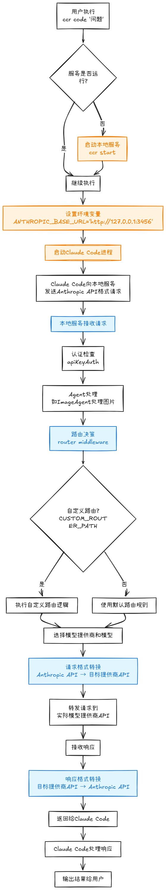

  📁 项目结构

  该项目采用了 TypeScript 编写，主要目录结构如下：
  - src/ - 核心源代码目录
    - agents/ - Agent 管理模块
    - middleware/ - 中间件，如认证功能
    - utils/ - 工具函数，包括路由、配置管理等
    - cli.ts - 命令行接口入口
    - index.ts - 主程序入口
    - server.ts - 服务端实现
  - ui/ - Web UI 界面相关代码
  - blog/ - 项目相关文档和博客文章

  ⚙️ 核心功能

  Claude Code Router 是一个强大的工具，主要功能包括：
  - 模型路由：根据需求将请求路由到不同的模型（后台任务、思考、长上下文等）
  - 多提供商支持：支持 OpenRouter、DeepSeek、Ollama、Gemini、Volcengine、SiliconFlow
  等多种模型提供商
  - 请求/响应转换：使用转换器为不同提供商自定义请求和响应格式
  - 动态模型切换：在 Claude Code 中使用 /model 命令动态切换模型
  - GitHub Actions 集成：在 GitHub 工作流程中触发 Claude Code 任务

  🔧 技术组件和依赖

  主要技术栈和依赖包括：
  - 框架：基于 @musistudio/llms 构建，该库基于 fastify 实现
  - 核心依赖：
    - fastify - 高性能 Web 框架
    - tiktoken - 用于计算 token 数量
    - json5 - 支持 JSON5 格式的配置文件解析
  - 认证和安全：支持 API Key 认证和 CORS 控制

  🎯 项目用途和工作原理

  该项目的主要目的是让没有 Anthropic 账户的用户也能使用 Claude Code，并且可以将请求路由到不同的
  LLM 提供商。

  工作原理如下：
  1. 环境变量覆盖：通过设置 ANTHROPIC_BASE_URL 环境变量，将 Claude Code 的请求重定向到本地服务
  2. 路由机制：根据配置文件中的路由规则，将不同类型的请求分发到不同的模型
  3. 请求转换：使用转换器将 Anthropic API 格式的请求转换为目标提供商的 API 格式
  4. 模型管理：支持多种模型提供商和模型，可以根据上下文长度、任务类型等条件动态选择模型

  项目支持四种默认路由模式：
  - default - 默认模型用于常规任务
  - background - 后台任务模型（通常为较小的本地模型以节省成本）
  - think - 推理密集型任务模型
  - longContext - 长上下文处理模型

  通过这种设计，用户可以在享受 Claude Code
  功能的同时，根据自己的需求和预算选择合适的模型提供商，实现成本和性能的平衡。

> 从用户在cli窗口输入 到agent输出的流程是怎么的，当前项目在claude 
code哪个环节做了处理，都兼容对接了多种模型，为什么还要转成`Anthropic API`格式 

● 🎉 现在我来为您详细解释从用户在CLI窗口输入到agent输出的完整流程，以及为什么需要转换成Anthropic
  API格式：

  🔄 用户输入到Agent输出的完整流程

  1. 用户在CLI窗口输入命令
    - 用户执行 ccr code "你的问题" 命令
    - CLI解析命令并调用 executeCodeCommand 函数
  2. 环境变量设置和Claude Code启动
    - 设置环境变量，将 ANTHROPIC_BASE_URL 指向本地服务 http://127.0.0.1:3456
    - 启动 Claude Code 进程，它会向 ANTHROPIC_BASE_URL 发送请求
  3. 请求拦截和路由处理
    - 本地服务接收到 Claude Code 的请求
    - 首先进行认证检查（apiKeyAuth）
    - 然后通过路由中间件（router）根据配置决定使用哪个模型提供商
  4. Agent处理
    - 如果请求包含图片等内容，会触发 ImageAgent 处理
    - Agent会对请求进行预处理，可能修改请求内容或添加工具
  5. 模型路由和转换
    - 根据配置选择合适的模型提供商和模型
    - 使用相应的转换器（transformer）将 Anthropic API 格式的请求转换为目标提供商的API格式
  6. 请求转发和响应处理
    - 将转换后的请求发送到实际的模型提供商API
    - 接收到响应后，再使用转换器将响应转换回 Anthropic API 格式
    - 返回给 Claude Code
  7. Claude Code处理和输出
    - Claude Code 接收到响应后进行处理
    - 向用户展示结果，可能包括文本、工具调用等

  🎯 项目在Claude Code中的处理环节

  Claude Code Router 在整个流程中主要处理以下几个环节：

  1. 请求拦截：通过设置 ANTHROPIC_BASE_URL 环境变量，拦截 Claude Code 发出的所有请求
  2. 认证和授权：检查 API Key，确保只有授权用户可以使用服务
  3. 智能路由：根据请求内容、上下文长度等条件，动态选择最适合的模型
  4. 格式转换：将 Anthropic API 格式的请求转换为目标提供商的API格式，再将响应转换回 Anthropic API
  格式
  5. Agent扩展：处理特殊内容如图片，提供额外的工具能力
  6. 日志和监控：记录请求日志，便于调试和监控

  🤔 为什么需要转换成Anthropic API格式

  这主要有以下几个重要原因：

  1. 兼容性考虑：Claude Code 是按照 Anthropic API
  规范设计的，它发送的请求格式和期望的响应格式都遵循 Anthropic API 标准。为了让 Claude Code
  能够正常使用，必须保持这个格式。
  2. 无缝集成：通过保持 Anthropic API 格式，用户不需要修改任何 Claude Code
  的配置或代码，只需要设置环境变量就能使用不同的模型提供商。
  3. 避免修改源码：这种方法避免了需要修改 Claude Code
  源码的复杂性，通过环境变量覆盖的方式实现请求转发，既简单又有效。
  4. 统一接口：无论后端使用哪个模型提供商（DeepSeek、Ollama、Gemini等），对 Claude Code
  来说都是统一的 Anthropic API 接口，简化了集成过程。
  5. Transformer机制：项目通过灵活的 Transformer 机制，可以适配各种不同的模型提供商API格式，同时对
   Claude Code 保持一致的接口。

  通过这种方式，Claude Code Router 实现了一个优雅的解决方案，既能让用户在没有 Anthropic
  账户的情况下使用 Claude Code，又能充分利用各种模型提供商的优势，实现了成本和性能的平衡。

> 你可以出一个流程图 
                                                                         

● 我来为您生成一个清晰的流程图，展示从用户在CLI窗口输入到agent输出的完整流程：

  flowchart TD
      A[用户执行 ccr code "问题"] --> B{服务是否运行?}
      B -->|否| C[启动本地服务 ccr start]
      B -->|是| D[继续执行]
      C --> D
      D --> E[设置环境变量 ANTHROPIC_BASE_URL=http://127.0.0.1:3456]
      E --> F[启动Claude Code进程]
      F --> G[Claude Code向本地服务 发送Anthropic API格式请求]
      G --> H[本地服务接收请求]
      H --> I[认证检查 apiKeyAuth]
      I --> J[Agent处理 如ImageAgent处理图片]
      J --> K[路由决策 router middleware]
      K --> L{自定义路由? CUSTOM_ROUTER_PATH}
      L -->|是| M[执行自定义路由逻辑]
      L -->|否| N[使用默认路由规则]
      M --> O[选择模型提供商和模型]
      N --> O
      O --> P[请求格式转换 Anthropic API → 目标提供商API]
      P --> Q[转发请求到 实际模型提供商API]
      Q --> R[接收响应]
      R --> S[响应格式转换 目标提供商API → Anthropic API]
      S --> T[返回给Claude Code]
      T --> U[Claude Code处理响应]
      U --> V[输出结果给用户]

      style H fill:#e1f5fe
      style K fill:#e1f5fe
      style P fill:#e1f5fe
      style S fill:#e1f5fe
      style C fill:#fff3e0
      style E fill:#fff3e0
      style F fill:#fff3e0

      classDef process fill:#e8f5e8,stroke:#388e3c;
      classDef router fill:#e1f5fe,stroke:#1976d2;
      classDef conversion fill:#fce4ec,stroke:#c2185b;
      classDef userAction fill:#fff3e0,stroke:#f57c00;

      class H,K,P,S router
      class C,E,F userAction

  这个流程图清晰地展示了整个处理流程，其中：

  - 用户操作区域（橙色）：用户执行命令和环境设置
  - 路由处理区域（蓝色）：Claude Code Router 的核心处理逻辑
  - 格式转换区域（粉色）：请求和响应的格式转换过程

  Claude Code Router 的关键作用体现在：
  1. 拦截 Claude Code 的请求
  2. 进行认证和路由决策
  3. 执行 Agent 处理（如图片处理）
  4. 进行 API 格式转换
  5. 将请求转发到实际的模型提供商并处理响应

  通过这种方式，用户可以在不修改 Claude Code 的情况下使用各种不同的模型提供商。

> 我理解了，ccr code在这里有三个作用：
1.启动ccr api服务并设置环境变量
2.启动Claude Code
3.转换处理Claude Code的请求 

● 🎉 您的理解完全正确！ccr code 命令确实有这三个核心作用：

  🎯 ccr code 的三大核心作用

  1. 启动CCR API服务并设置环境变量

  # 设置关键环境变量
  ANTHROPIC_BASE_URL=http://127.0.0.1:3456  # 将Claude Code请求重定向到本地
  ANTHROPIC_AUTH_TOKEN=your-api-key         # 认证token
  NO_PROXY=127.0.0.1                        # 避免代理干扰

  2. 启动Claude Code进程

  - 检查服务是否运行，如果未运行则自动启动
  - 通过spawn启动Claude Code主进程
  - 传递用户参数和配置设置

  3. 转换处理Claude Code的请求

  这是最核心的部分：
  - 请求拦截：拦截Claude Code发送的所有请求
  - 格式转换：Anthropic API ↔ 各种模型API
  - 智能路由：根据内容选择最适合的模型
  - Agent扩展：处理图片等特殊内容

  🔄 完整的工作流程

  用户执行: ccr code "帮我写一个Hello World"
           ↓
  检查服务状态 → 如果未运行则启动服务
           ↓
  设置环境变量，重定向Claude Code请求
           ↓
  启动Claude Code进程
           ↓
  Claude Code发送请求到 http://127.0.0.1:3456
           ↓
  CCR服务接收并处理:
    ├── 认证检查
    ├── Agent预处理(如图片)
    ├── 智能路由决策
    ├── 请求格式转换
    └── 转发到目标模型API
           ↓
  接收模型响应并转换回Anthropic格式
           ↓
  返回给Claude Code处理
           ↓
  用户获得结果

  这种设计的巧妙之处在于完全透明 - 用户只需要像正常使用Claude Code一样操作，而CCR在背后完成了所有复杂的转换和路由工作！

  