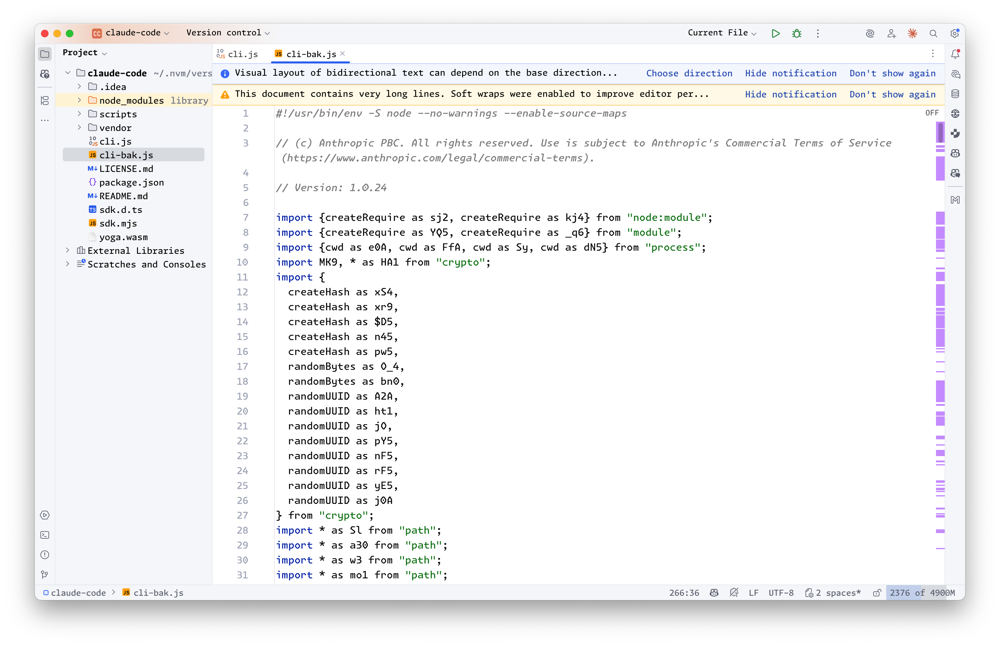
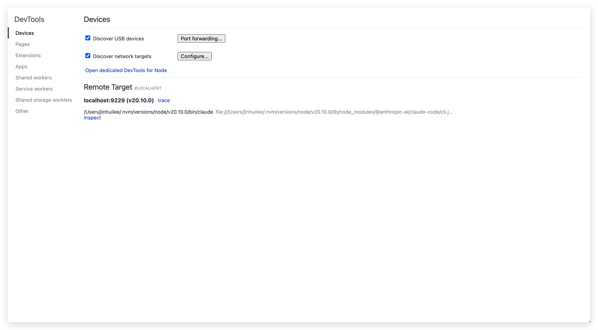
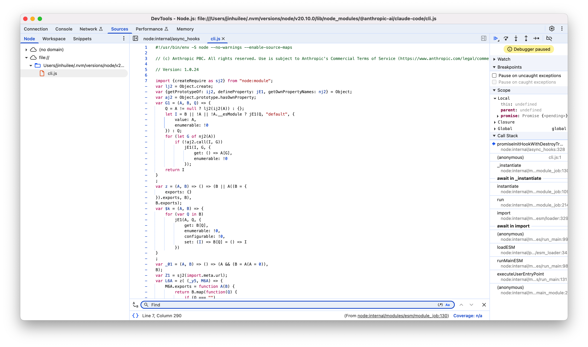
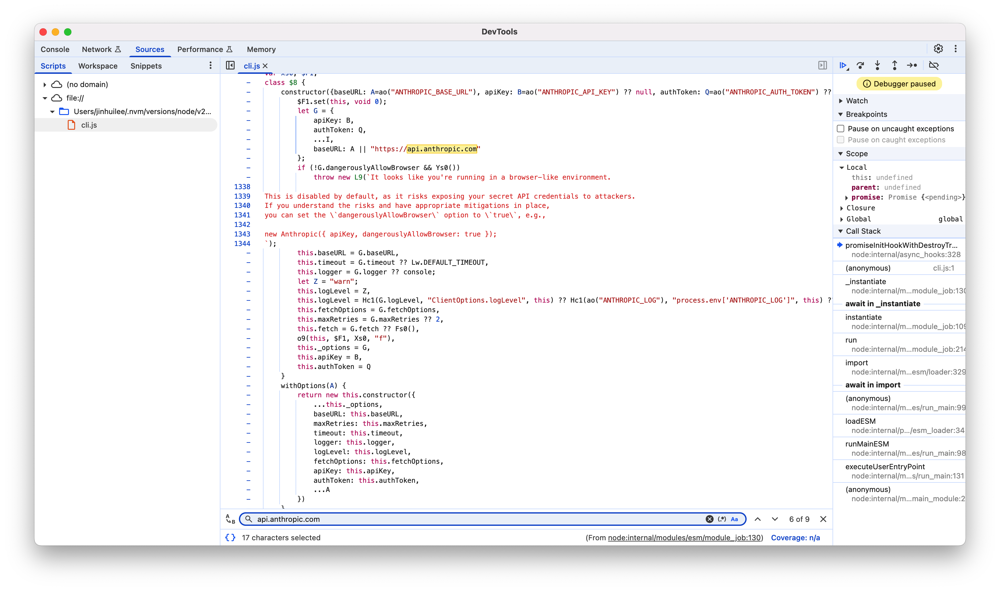

# 项目初衷及原理

早在 Claude Code 发布的第二天(2025-02-25)，我就尝试并完成了对该项目的逆向。当时要使用 Claude Code 你需要注册一个 Anthropic 账号，然后申请 waitlist，等待通过后才能使用。但是因为众所周知的原因，Anthropic 屏蔽了中国区的用户，所以通过正常手段我无法使用，通过已知的信息，我发现：

1. Claude Code 使用 npm 进行安装，所以很大可能其使用 Node.js 进行开发。
2. Node.js 调试手段众多，可以简单使用`console.log`获取想要的信息，也可以使用`--inspect`将其接入`Chrome Devtools`，甚至你可以使用`d8`去调试某些加密混淆的代码。

由于我的目标是让我在没有 Anthropic 账号的情况下使用`Claude Code`，我并不需要获得完整的源代码，只需要将`Claude Code`请求 Anthropic 模型时将其转发到我自定义的接口即可。接下来我就开启了我的逆向过程：

1. 首先安装`Claude Code`

```bash
npm install -g @anthropic-ai/claude-code
```

2. 安装后该项目被放在了`~/.nvm/versions/node/v20.10.0/lib/node_modules/@anthropic-ai/claude-code`中，因为我使用了`nvm`作为我的 node 版本控制器，当前使用`node-v20.10.0`，所以该路径会因人而异。
3. 找到项目路径之后可通过 package.json 分析包入口,内容如下：

```package.json
{
  "name": "@anthropic-ai/claude-code",
  "version": "1.0.24",
  "main": "sdk.mjs",
  "types": "sdk.d.ts",
  "bin": {
    "claude": "cli.js"
  },
  "engines": {
    "node": ">=18.0.0"
  },
  "type": "module",
  "author": "Boris Cherny <boris@anthropic.com>",
  "license": "SEE LICENSE IN README.md",
  "description": "Use Claude, Anthropic's AI assistant, right from your terminal. Claude can understand your codebase, edit files, run terminal commands, and handle entire workflows for you.",
  "homepage": "https://github.com/anthropics/claude-code",
  "bugs": {
    "url": "https://github.com/anthropics/claude-code/issues"
  },
  "scripts": {
    "prepare": "node -e \"if (!process.env.AUTHORIZED) { console.error('ERROR: Direct publishing is not allowed.\\nPlease use the publish-external.sh script to publish this package.'); process.exit(1); }\"",
    "preinstall": "node scripts/preinstall.js"
  },
  "dependencies": {},
  "optionalDependencies": {
    "@img/sharp-darwin-arm64": "^0.33.5",
    "@img/sharp-darwin-x64": "^0.33.5",
    "@img/sharp-linux-arm": "^0.33.5",
    "@img/sharp-linux-arm64": "^0.33.5",
    "@img/sharp-linux-x64": "^0.33.5",
    "@img/sharp-win32-x64": "^0.33.5"
  }
}
```

其中`"claude": "cli.js"`就是我们要找的入口，打开 cli.js，发现代码被压缩混淆过了。没关系，借助`webstorm`的`Formate File`功能可以重新格式化，让代码变得稍微好看一点。就像这样：


现在，你可以通过阅读部分代码来了解`Claude Code`的内容工具原理与提示词。你也可以在关键地方使用`console.log`来获得更多信息，当然，也可以使用`Chrome Devtools`来进行断点调试，使用以下命令启动`Claude Code`:

```bash
NODE_OPTIONS="--inspect-brk=9229" claude
```

该命令会以调试模式启动`Claude Code`，并将调试的端口设置为`9229`。这时候通过 Chrome 访问`chrome://inspect/`即可看到当前的`Claude Code`进程，点击`inspect`即可进行调试。



通过搜索关键字符`api.anthropic.com`很容易能找到`Claude Code`用来发请求的地方，根据上下文的查看，很容易发现这里的`baseURL`可以通过环境变量`ANTHROPIC_BASE_URL`进行覆盖，`apiKey`和`authToken`也同理。


到目前为止，我们获得关键信息：

1. 可以使用环境变量覆盖`Claude Code`的`BaseURL`和`apiKey`的配置

2. `Claude Code`使用[Anthropic API](https://docs.anthropic.com/en/api/overview)的规范

所以我们需要：

1. 实现一个服务用来将`OpenAI API`的规范转换成`Anthropic API`格式。

2. 启动`Claude Code`之前写入环境变量将`baseURL`指向到该服务。

于是，`claude-code-router`就诞生了，该项目使用`Express.js`作为 HTTP 服务，实现`/v1/messages`端点，使用`middlewares`处理请求/响应的格式转换以及请求重写功能(可以用来重写 Claude Code 的提示词以针对单个模型进行调优)。
在 2 月份由于`DeepSeek`全系列模型对`Function Call`的支持不佳导致无法直接使用`DeepSeek`模型，所以在当时我选择了`qwen-max`模型，一切表现的都很好，但是`qwen-max`不支持`KV Cache`，意味着我要消耗大量的 token，但是却无法获取`Claude Code`原生的体验。
所以我又尝试了`Router`模式，即使用一个小模型对任务进行分发，一共分为四个模型:`router`、`tool`、`think`和`coder`，所有的请求先经过一个免费的小模型，由小模型去判断应该是进行思考还是编码还是调用工具，再进行任务的分发，如果是思考和编码任务将会进行循环调用，直到最终使用工具写入或修改文件。但是实践下来发现免费的小模型不足以很好的完成任务的分发，再加上整个 Agnet 的设计存在缺陷，导致并不能很好的驱动`Claude Code`。
直到 5 月底，`Claude Code`被正式推出，这时`DeepSeek`全系列模型(R1 于 05-28)均支持`Function Call`，我开始重新设计该项目。在与 AI 的结对编程中我修复了之前的请求和响应转换问题，在某些场景下模型输出 JSON 响应而不是`Function Call`。这次直接使用`DeepSeek-v3`模型，它工作的比我想象中要好：能完成绝大多数工具调用，还支持用步骤规划解决任务，最关键的是`DeepSeek`的价格不到`claude Sonnet 3.5`的十分之一。正式发布的`Claude Code`对 Agent 的组织也不同于测试版，于是在分析了`Claude Code`的请求调用之后，我重新组织了`Router`模式：现在它还是四个模型：默认模型、`background`、`think`和`longContext`。

- 默认模型作为最终的兜底和日常处理

- `background`是用来处理一些后台任务，据 Anthropic 官方说主要用`Claude Haiku 3.5`模型去处理一些小任务，如俳句生成和对话摘要，于是我将其路由到了本地的`ollama`服务。

- `think`模型用于让`Claude Code`进行思考或者在`Plan Mode`下使用，这里我使用的是`DeepSeek-R1`，由于其不支持推理成本控制，所以`Think`和`UltraThink`是一样的逻辑。

- `longContext`是用于处理长下上文的场景，该项目会对每次请求使用tiktoken实时计算上下文长度，如果上下文大于32K则使用该模型，旨在弥补`DeepSeek`在长上下文处理不佳的情况。

以上就是该项目的发展历程以及我的一些思考，通过巧妙的使用环境变量覆盖的手段在不修改`Claude Code`源码的情况下完成请求的转发和修改，这就使得在可以得到 Anthropic 更新的同时使用自己的模型，自定义自己的提示词。该项目只是在 Anthropic 封禁中国区用户的情况下使用`Claude Code`并且达到成本和性能平衡的一种手段。如果可以的话，还是官方的Max Plan体验最好。
